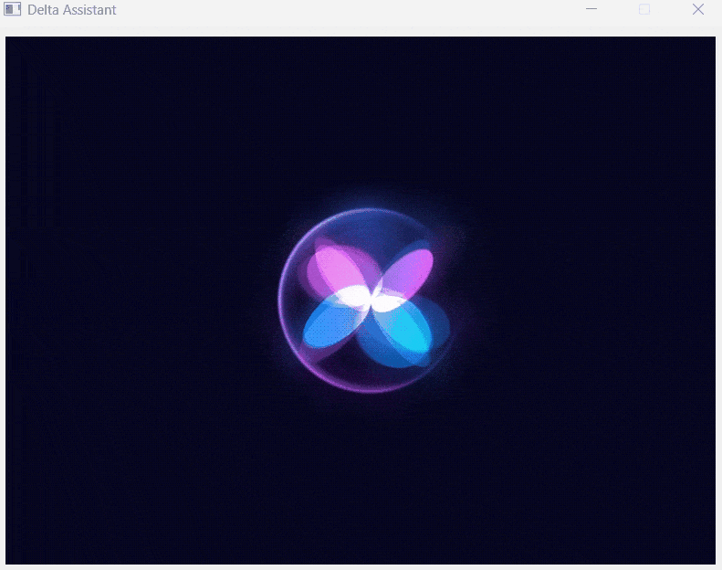

# Delta Virtual Assistant

## 01 Repo Structure


```
    ├── docs                                   # Contains documents  
    ├── research                               # Contains pre-research. 
    ├── source                                 # Contains project source code.
    │   ├── main.py                                # Main app file.
    └── README.MD                              # Readme Content.
```

## 02 Introduction

An elementary level assistant for Windows, Delta Virtual Assistant is a Python-based tool designed to simplify everyday tasks by performing basic computer operations and providing fundamental personal assistant services. With Delta, users can effortlessly manage applications, navigate files and directories and retrieve information from the web using simple voice commands. Its user-friendly interface and straightforward functionality make it an ideal choice for those looking to enhance their productivity with minimal effort.

Whether you're looking to streamline your workflow or simply need a helping hand with routine tasks, Delta Virtual Assistant is here to make your computing experience more efficient and enjoyable. This versatile assistant not only boosts your productivity but also adds a layer of convenience to your daily computer interactions, making it an invaluable tool for users of all skill levels. Explore the capabilities of Delta Virtual Assistant and transform the way you interact with your Windows computer.


## 03 Technology Stack

- Python: 3.6^
- speech_recognition
- pyttsx3
- PyQt5
- pygame
- googlesearch
- wikipedia

## 04 Setup

- **Step 01:** Install Python

  ```
    https://python.org/
  ```

- **Step 02:** Navigate to docs folder


  ```
   cd docs
  ```

- **Step 03:** Install the requirements.txt

  ```
    pip install -r requirements.txt
  ```


## 05 Usage

### 5.1 Launch the app

- **Step 01:** Navigate to source folder

  ```
    cmd source 
  ```

- **Step 02:** Run main.py

  ```
    python main.py 
  ```


### 5.2 Output



## 06 Development

### 6.1 Project Structure 

```
    ├── source                            # Contains project source code.
    │   ├── asset                           # Contains assets of the app.
    │   │   ├── controller.py                 # Contains functions to control the computer.
    │   │   ├── responser.py                  # Contains responses to queries.
    │   ├── main.py                                # Main app file.
    └── README.MD                              # Readme Content.
```

- **To Upgrade Functions:** Edit the controller.py to add extra functions to control the computer. 

- **To Upgrade Responses:** Edit the responser.py to add extra responses.

- **To Upgrade Extra Features:** Edit the main.py to improve features.

### 6.2 Code Guides

- **Commit Messages:** Use the conventional commits messages.

- **Code Naming Convention:** Use snake_case for coding.

- **Directory Naming Convention:** Use kebab-case for directory & files.

## 07 Documentation

### Sample Voice Inputs

```
Command 1: Open Youtube
Command 2: Open Google
Command 3: Open Gmail

Command 5: How are you doing?
Command 6: Tell me about AI
Command 6: What is your purpose?

```
# Contact

### Website: 

[](https://www.gunarakulan.info)

### Social Media:

[](https://www.linkedin.com/in/gunarakulangunaretnam)
[](https://www.facebook.com/gunarakulangunaretnam)
[](https://wa.me/94740001141?text=WhatsApp%3A%20%2B9740001141)
[](https://www.instagram.com/gunarakulangunaretnam)
[](https://x.com/gunarakulangr)
[](https://www.kaggle.com/gunarakulangr)
[](https://www.tiktok.com/@gunarakulangunaretnam)
[](https://www.youtube.com/channel/UCjMOdgHFAjAdBKiqV8y2Tww)